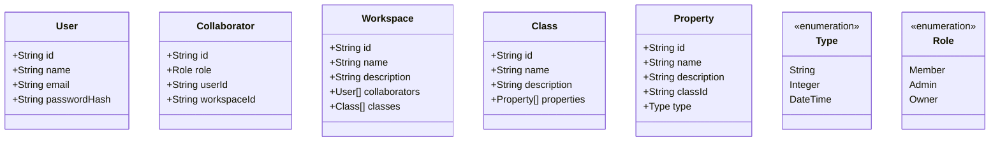

```mermaid
classDiagram

class User {
  +String id
  +String name
  +String email
  +String passwordHash
}

class Collaborator {
  +String id
  +Role role
  +String userId
  +String workspaceId
}

class Workspace {
  +String id
  +String name
  +String description
  +User[] collaborators
  +Class[] classes
}

class Class {
  +String id
  +String name
  +String description
  +Property[] properties
}

class Property {
  +String id
  +String name
  +String description
  +String classId
  +Type type
}

class Type {
  <<enumeration>>
  String
  Integer
  DateTime
}

class Role {
  <<enumeration>>
  Member
  Admin
  Owner
}


```
